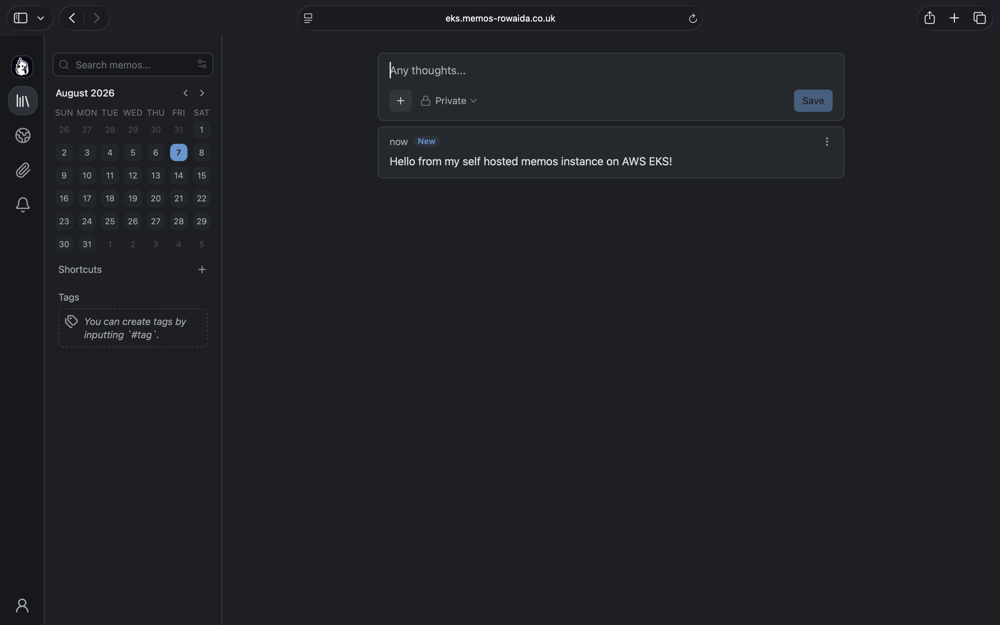
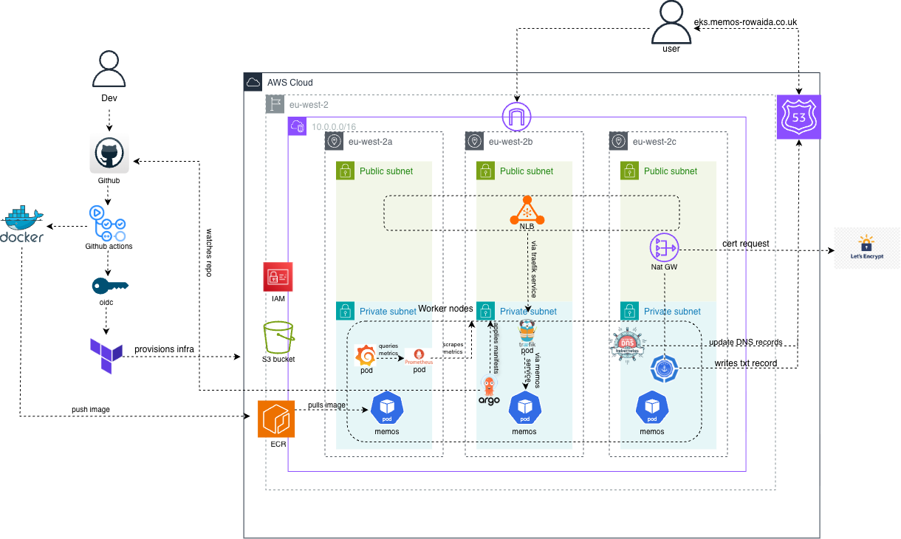
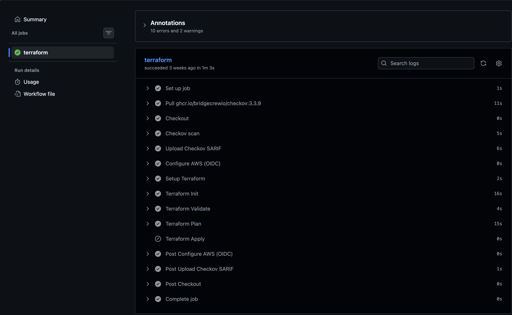
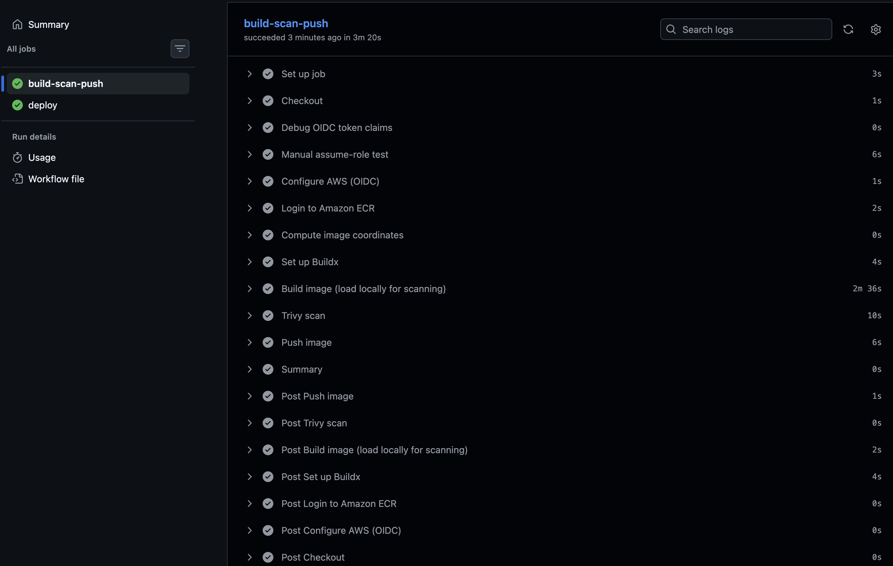
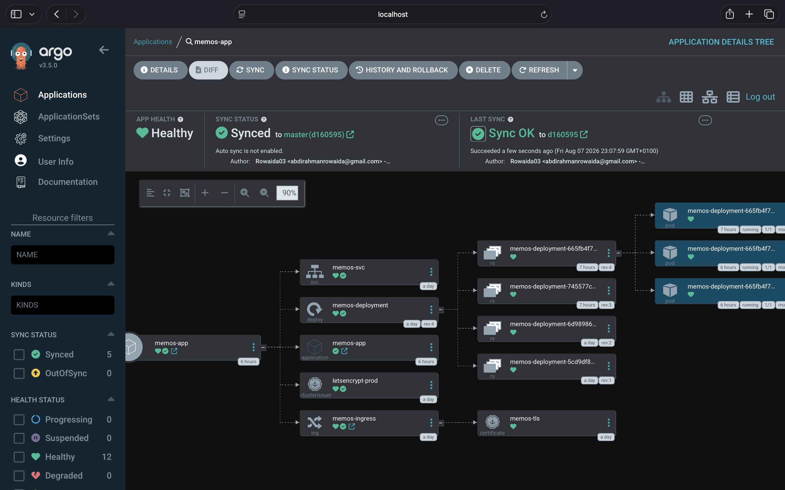
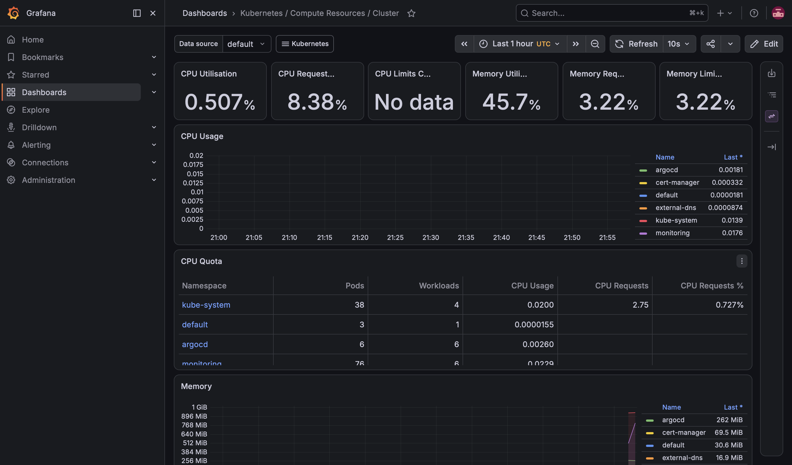

# EKS Deployment Project: memos on AWS

A production style deployment of memos, an open-source note taking application, on Amazon EKS, built with Terraform, secured with IRSA, exposed via Traefik + the AWS Load Balancer Controller, automatically issued a TLS certificate via cert-manager, given a live domain via external-dns/Route53, deployed through GitOps with ArgoCD, and observed with Prometheus/Grafana. CI/CD is handled by two GitHub Actions pipelines using OIDC.

## Memos running on EKS


## Table of contents

- [Running this locally](#running-this-locally)
- [Architecture](#architecture-diagram)
- [Tech stack](#tech-stack)
- [Repository layout](#repository-layout)
- [Infrastructure](#infrastructure-terraform)
- [Kubernetes add-ons](#kubernetes-addons)
- [Application deployment](#application-deployment)
- [GitOps (ArgoCD)](#gitops-argocd)
- [CI/CD pipelines](#cicd-pipelines)
- [Monitoring](#monitoring)
- [Key decisions and tradeoffs](#key-decisions--tradeoffs)
- [Known limitations/ improvements to be made](#known-limitations-and-what-id-do-next)


## Running this locally
Everything in infra/ and kubernetes/ targets a real EKS cluster, but the app itself can be run entirely on your own machine with just Docker.

### Option A - plain Docker
```
docker build -t memos-local -f Dockerfile .
docker run -d --name memos -p 5230:5230 -v ~/.memos:/var/opt/memos
```
Then open http://localhost:5230 and create the admin account.

 The -v flag persists your data in ~/.memos on your host, so it survives container restarts (unlike the ephemeral setup used on EKS in this project. See tradeoffs).  *****!!!make it tap

### Option B - Local Kubernetes (Kind, Minikube, Orbstack etc):

 INSERT THE RELEVANT CODE HERE !!!!!!

## Architecture diagram



**Request flow**: Browser→Route53(DNS)→NLB→Traefik Ingress→memos-svc→memos-deployment pods. TLS is terminated by traefik using a certificate issued by cert-manager via Let's Encrypt (DNS-01 challenge through Route53).


## Tech Stack

| Layer | Tool | Why |
|---|---|---|
| IaC | Terraform (`terraform-aws-modules/vpc`, `.../eks`, `.../iam`) | Reusable, well-maintained community modules |
| Container orchestration | Amazon EKS 1.33 | Managed control plane |
| Ingress | Traefik | Routes incoming HTTP/S traffic to the right Kubernetes Service |
| Load balancing | AWS Load Balancer Controller (NLB) | Provisions and manages the real AWS load balancer that sits in front of Traefik, exposing it to the internet |
| TLS | cert-manager + Let's Encrypt | Free, auto-renewing certs, DNS-01 challenge via Route53 |
| DNS | external-dns + Route53 | Ingress changes automatically create/update DNS records |
| IAM for pods | IRSA (IAM Roles for Service Accounts) | Least-privilege AWS access per component, no static credentials in-cluster |
| GitOps | ArgoCD | Cluster state reconciled from Git |
| CI/CD | GitHub Actions + OIDC | No long-lived AWS access keys stored as secrets |
| Image scanning | Trivy | Vulnerability scanning of the built image before push |
| IaC scanning | Checkov | Static analysis of Terraform for misconfigurations |
| Registry | Amazon ECR | Private, IAM-authenticated registry integrated with EKS |
| Monitoring | kube-prometheus-stack (Prometheus + Grafana) | Cluster and workload metrics, pre-built dashboards |
| App | [usememos/memos](https://github.com/usememos/memos) | Self-hosted note-taking app, SQLite-backed |


## Repository layout

```
.
├── .github/workflows/
│   ├── terraform.yml              # Pipeline 1: scan, validate, plan, apply infra
│   └── build-deploy-ecr.yaml      # Pipeline 2: build, scan, push image, deploy
├── infra/                         # Terraform root module
│   ├── vpc.tf
│   ├── eks.tf
│   ├── ecr.tf
│   ├── irsa.tf                    # cert-manager / external-dns / LB controller IRSA roles
│   ├── github-oidc.tf             # GitHub OIDC provider + CI role
│   ├── helm-releases.tf           # Traefik, cert-manager, external-dns, ALB controller,
│   │                              # ArgoCD, kube-prometheus-stack
│   ├── helm/                      # values.yaml files for each Helm release
│   ├── locals.tf
│   ├── backend.tf
│   └── providers.tf
├── kubernetes/                    # Plain manifests, synced by ArgoCD
│   ├── memos-deployment.yaml
│   ├── memos-ingress.yaml
│   ├── cluster-issuer.yaml
│   └── argocd-app.yaml
├── memos/                         # Application source (usememos/memos)
├── bootstrap/                     # One-time Terraform state backend (S3 + native locking)
├── images/                        # Diagrams and screenshots for this README
└── dockerfile                     # Multi-stage build for the memos image
```

## Infrastructure (Terraform)

### VPC

- `Terraform-aws-modules/vpc/aws`, 3 AZs, public + private subnets.
- Single NAT gateway - see tradeoffs below !!!!! make that underlined
- Public subnets tagged `kubernetes.io/role/elb`, private tagged `kubernetes.io/role/internal-elb`, both tagged `kubernetes.io/cluster/<cluster-name>` - required for automatic load balancer subnet discovery. 

### EKS

- `terraform-aws-modules/eks/aws v21`.
- Cluster addons(`vpc-cni`, `coredns`, `kube-proxy`) installed via the module's `addons` block, with `vpc-cni` set to `before_compute = true` so networking exists before worker nodes try to join. Without this, nodes join but never report `Ready` (CNI never initialises).
- A single managed node group. Instance type was iterated on during development (see tradeoffs) and settled on `m7i-flex.large`.
- `access_entries` grants CI/CD OIDC role cluster access.


### State backend 

- Bootstrapped separately (`bootstrap/`):S3 bucket with versioning and encryption, using Terraform's native s3 locking(`use_lockfile = true`) rather than a DynamoDB table. This was the simpler and more recent way to protect against concurrent applies. 

### CI/CD access(OIDC)

- GitHub Actions needs AWS permissions to push images to ECR, run `terraform apply`, and deploy to the cluster. The obvious way to do that is to generate an IAM access key and paste it into GitHub
as a secret. But that means a long-lived credential sitting in a third-party system indefinitely, which is a real security liability: if it leaks, it stays valid until someone notices and revokes it.
- GitHub is registered in AWS IAM as an OpenID Connect identity provider (`github-oidc.tf`).
- An IAM role (`github-ecr-pusher`) trusts that provider
- When a workflow runs, GitHub mints a short-lived, signed token describing the run (which repo, which branch, which workflow file).
- The workflow hands that token to AWS STS, which verifies the signature, checks it against the role's trust conditions, and if it matches returns temporary credentials valid for that run only.


## Kubernetes addons

All installed as Terraform helm_release resources so infra and addons are provisioned together and tracked in the same state.

| Add-on | Namespace | IRSA? | Purpose |
|---|---|---|---|
| Traefik | `traefik` | No | Ingress controller, fronted by an NLB |
| AWS Load Balancer Controller | `kube-system` | Yes | Provisions the NLB for Traefik's `LoadBalancer` Service |
| cert-manager | `cert-manager` | Yes (Route53 scoped) | Issues/renews TLS certs via Let's Encrypt DNS-01 |
| external-dns | `external-dns` | Yes (Route53 scoped) | Creates Route53 records from Ingress hosts |
| ArgoCD | `argocd` | No | GitOps continuous delivery |
| kube-prometheus-stack | `monitoring` | No | Prometheus, Grafana, Alertmanager |

### Application deployment 
Memos is deployed as plain Kubernetes manifests (Deployment, Service,Ingress), not a Helm chart. A delibrate choice i made. See !!tradeoffs!!!. The image is built from the app's mult-stage dockerfile (Go backend + React frontend), pushed to ECR, and referenced directly in the deployment.

The `Ingress` carries `cert-manager.io/cluster-issuer` line, which triggers automatic certificate issuance the moment it's applied, and a `host:` field that external-dns watches to create the matching Route53 record. No manual DNS or certificate steps required once Ingress is applied.


### GitOps (ArgoCD)

An ArgoCD `Application` object (`kubernetes/argocd-app.yaml`) points at the `kubernetes/` folder in this repo. ArgoCD reconciles the live cluster state to match what's commited to Git. This ensures that Git becomes the single source of truth. 

Prune and self heal is also enabled and automatic synchronisation between cluster and Git. 

### CI/CD pipelines

#### Pipeline 1 - `build-deploy-ecr.yaml`

Runs on push to `master` (plus a manual dispatch feature):

1. Checkout
2. Authenticate to AWS via OIDC
3. Log in to ECR
4. Build the docker image
5. Trivy scan of the image for vulnerabilities 
6. Push the image to ECR
7. Update the running Deployment's image and wait for rollout

#### Pipleine 2 - `terraform.yaml`

Runs on changes under `infra/`:

1. Checkout
2. Checkov scan of the terraform code
3. Authenticate to AWS via OIDC
4. `terraform init`➔`validate`➔`plan`➔`apply`

### Monitoring

The Helm chart `kube-prometheus-stack` provides Prometheus, Grafana, and Alertmanager with pre-built dashboards.

## Key decisions & tradeoffs

Single NAT gateway instead of one per AZ. Cuts NAT costs however if that one AZ has an outage every private subnet loses outbound internet access. Acceptable for a project of this scope however a regional NAT gateway is the better choice.


Plain manifests for memos, not a Helm chart. The app's own object set is small. Wrapping it in a Helm chart (templating,`values.yaml`, `chart.yaml`) would add packaging overhead and no real benefit at this scale. Helm was used for third party addons specifically because those ship dozens of interlocking objects.

No persistent storage for memos. memos stores data in a local SQLite file inside the container. No EFS-backed PersistentVolume or S3 config was added. This means data is lost whenever a pod restarts, and the Deployment was reduced to replicas: 1 (multiple replicas would each have their own disconnected database, causing inconsistent login/data behavior). This is a conscious, documented tradeoff for a time-boxed learning/demo project, not an oversight. In production this would need an EFS-backed PersistentVolume or memos' built-in S3 storage config.

Instance type: t2/t3.micro → t3.small → m7i-flex.large. Started on free-tier-eligible micro instances (an account-level vCPU restriction blocked larger types initially). Micro instances have a very low per-node pod/ENI ceiling. Running memos, cert-manager, external-dns, Traefik, the LB controller, ArgoCD, and Prometheus/Grafana together repeatedly hit "too many pods" scheduling failures well before any CPU/memory limit was reached. Moving to m7i-flex.large (fewer, larger nodes) fixed this directly and also reduced total node-group churn.

### Known limitations and what Id do next

- Add EFS-backed persistent storage
- Add a `kubeconform`/manifest-liniting step to catch YAML errors before ArgoCD attempts a sync.
- Correct the node group size further now that the workload set is stable. (Current sizing was chosen empirically while debugging) 


# Workflows





# Dashboards






